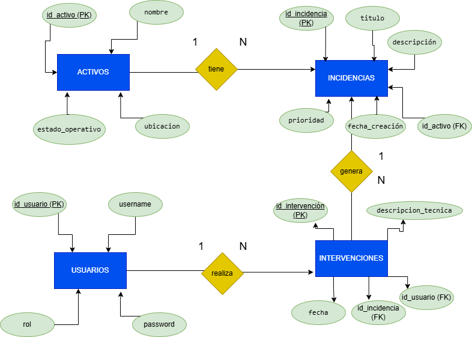
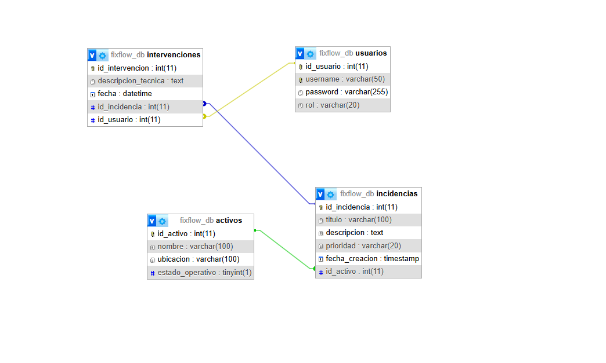
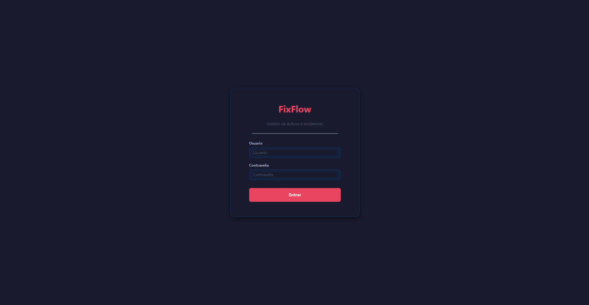
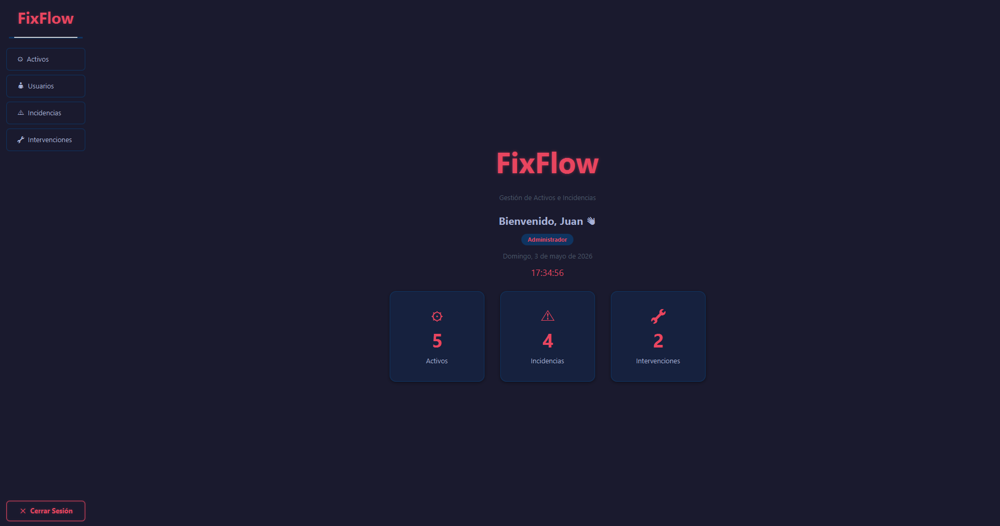
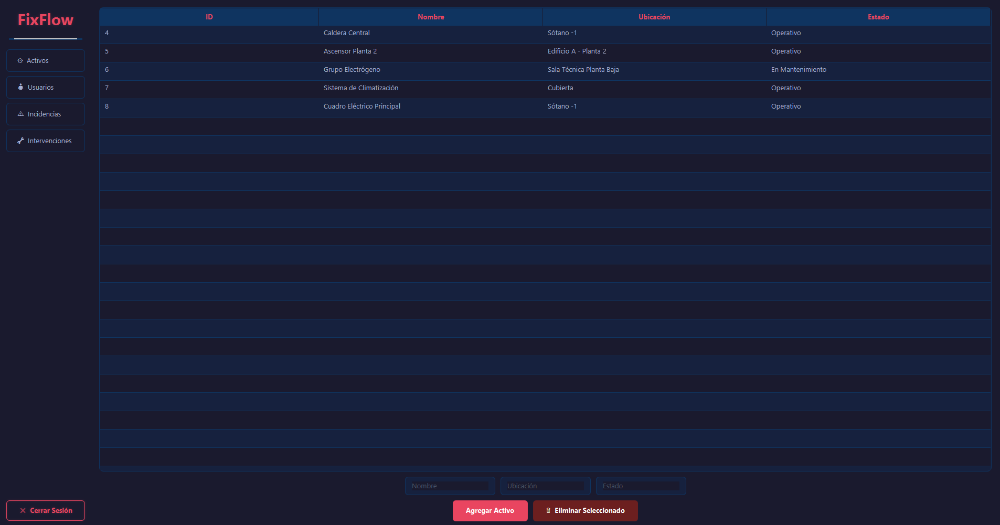
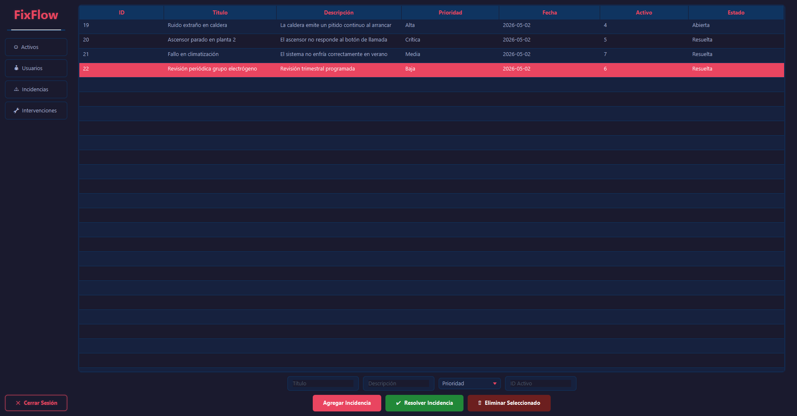
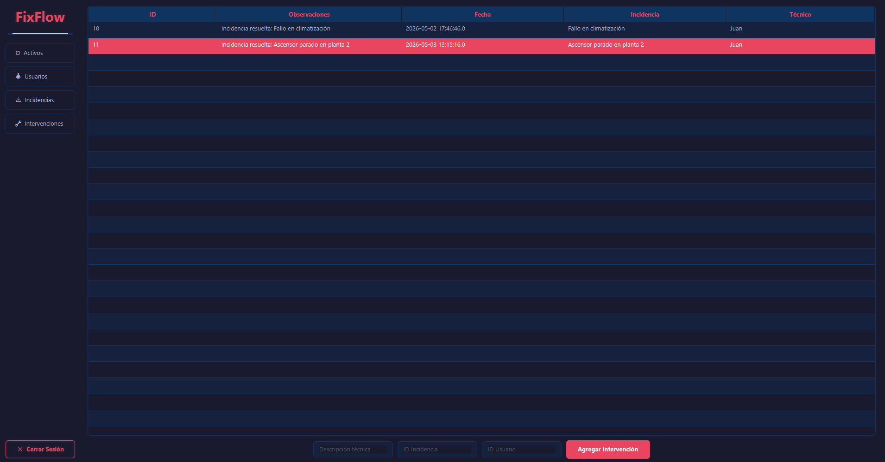

# FixFlow — Gestión de Activos e Incidencias

**Autor:** Jaime Gregori Almiñana  
**Curso:** 1º Técnico Superior en Desarrollo de Aplicaciones Multiplataforma (DAM)  
**Centro:** Prometeo by The Power FP Oficial  
**Proyecto:** Intermodular de 1º DAM  

---

## ¿Qué es FixFlow?

FixFlow es una aplicación de escritorio desarrollada en Java con JavaFX para la gestión integral de activos e incidencias técnicas en entornos empresariales.

Permite registrar los activos de una empresa (maquinaria, equipos, instalaciones), reportar incidencias sobre ellos, y que los técnicos las resuelvan generando intervenciones automáticas con trazabilidad completa.

---

## ¿Qué problema resuelve?

En muchas empresas, la gestión de averías e incidencias técnicas se hace de forma manual o desordenada. FixFlow centraliza todo el proceso:

- Un **administrador** gestiona activos, usuarios e incidencias.
- Un **técnico** recibe las incidencias y las marca como resueltas desde la propia aplicación.
- Cada resolución queda registrada automáticamente como intervención, con fecha, técnico responsable y observaciones.

---

## Tecnologías utilizadas

| Tecnología | Uso |

| Java 17 | Lenguaje principal |
| JavaFX | Interfaz gráfica de escritorio |
| MySQL | Base de datos relacional |
| JDBC | Conexión entre Java y MySQL |
| Maven | Gestión de dependencias |
| IntelliJ IDEA | Entorno de desarrollo |
| Scene Builder | Diseño visual de FXML |
| phpMyAdmin | Administración de la base de datos |

---

## Funcionalidades principales

- Login con autenticación contra base de datos
- Sistema de roles: **Administrador** y **Técnico**
- Dashboard con estadísticas en tiempo real (activos, incidencias, intervenciones)
- CRUD completo de **Activos**, **Usuarios** e **Incidencias**
- Botón **Resolver Incidencia**: marca la incidencia como resuelta y genera una intervención automática
- Registro de **Intervenciones** con técnico responsable, fecha y observaciones
- Eliminación de registros con validaciones
- Interfaz oscura personalizada con CSS propio

---

## Estructura del repositorio

---

## Instalación y ejecución

### Requisitos previos

- Java 17 o superior
- MySQL 8.0 o superior
- Maven 3.8 o superior

## Usuarios de prueba

| Usuario | Contraseña | Rol |
|---|---|---|
| Juan | 123 | Administrador |
| Tecnico1 | 123 | Técnico |

### Pasos

1. Clona el repositorio:
```bash
git clone https://github.com/jaimegregori/FixFlow_Intermodular.git
```

2. Importa la base de datos ejecutando el script SQL en phpMyAdmin o MySQL:
```bash
mysql -u root -p < sql/script_completo.sql
```

3. Configura la conexión en `src/main/java/com/fixflow/database/Conexion.java`:
```java
private static final String URL = "jdbc:mysql://localhost:3306/fixflow_db";
private static final String USER = "tu_usuario";
private static final String PASSWORD = "tu_contraseña";
```

4. Abre el proyecto en IntelliJ IDEA y ejecuta la clase `Main.java`.

---

## Arquitectura del proyecto

El proyecto sigue una arquitectura en capas inspirada en el patrón MVC:

- **Modelo** (`modelos/`) — Clases Java que representan las entidades: `Activo`, `Incidencia`, `Intervencion`, `Usuario`, `Sesion`.
- **DAO** (`dao/`) — Clases de acceso a datos con consultas SQL mediante JDBC: `ActivoDAO`, `IncidenciaDAO`, `IntervencionDAO`, `UsuarioDAO`.
- **Controlador** (`controller/`) — Lógica de la interfaz: `MainViewController`, `LoginController`.
- **Vista** (`resources/*.fxml`) — Archivos FXML con la estructura visual de cada pantalla.
- **CSS** (`style.css`) — Estilos globales aplicados a toda la aplicación.

---

## Base de datos

La base de datos `fixflow_db` contiene 4 tablas:

- `usuarios` — Usuarios del sistema con rol (Administrador / Técnico)
- `activos` — Equipos e instalaciones de la empresa
- `incidencias` — Averías o problemas reportados sobre activos, con estado (Abierta / Resuelta)
- `intervenciones` — Registro de resoluciones técnicas con técnico, fecha y observaciones

Las tablas están relacionadas mediante claves foráneas con integridad referencial.

---

## Diagrama E/R



## Modelo Relacional



---

## Mejoras MPO (Ampliación de Programación)

- **Separación en capas**: modelo, DAO, controlador y vista completamente separados.
- **Patrón DAO**: cada entidad tiene su propia clase de acceso a datos, evitando duplicidad de código.
- **Sistema de sesión global** (`Sesion.java`): gestión centralizada del usuario logueado y sus permisos.
- **Sistema de permisos por rol**: los técnicos no pueden acceder al módulo de usuarios.
- **Transacciones SQL**: el registro de intervenciones usa transacciones para garantizar la integridad de los datos.
- **Dashboard en tiempo real**: reloj actualizado cada segundo mediante `Timeline` de JavaFX.

---

## Evidencias de funcionamiento







---

## Aprendizajes obtenidos

- Desarrollo de aplicaciones de escritorio con JavaFX y FXML
- Conexión a base de datos MySQL mediante JDBC
- Diseño de interfaces con CSS personalizado en JavaFX
- Aplicación del patrón MVC y arquitectura en capas
- Gestión de roles y permisos en aplicaciones reales
- Control de versiones con Git y GitHub
- Diseño y normalización de bases de datos relacionales
